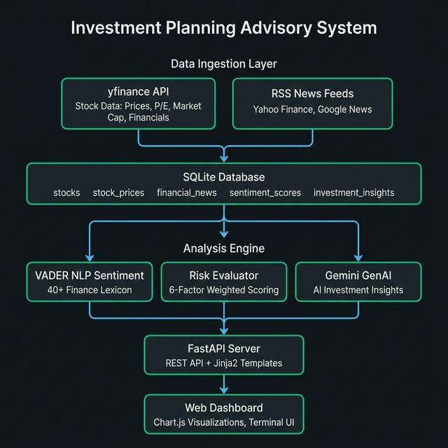

# Investment Planning Advisory System

**GenAI-Based Real-Time Investment Advisory System | Python, SQL, NLP**

**[Live Demo →](https://investment-planning-advisory-system.onrender.com/)**

A full-stack AI-powered investment advisory system that analyzes real-time stock market data, performs NLP sentiment analysis on financial news, evaluates multi-factor risk, and generates actionable investment insights using GenAI.


---

## Features

| Feature | Description |
|---|---|
| **Real-Time Stock Data** | Fetches live prices, P/E ratios, market cap, financial statements via `yfinance` API |
| **Financial News Aggregation** | Collects news from Yahoo Finance & Google News RSS feeds |
| **NLP Sentiment Analysis** | VADER-based sentiment scoring with 40+ finance-specific lexicon terms |
| **Multi-Factor Risk Evaluation** | 6-factor weighted risk scoring (P/E, volatility, debt, sentiment, margins, beta) |
| **GenAI Investment Insights** | Google Gemini-powered actionable recommendations with confidence levels |
| **Premium Dark Dashboard** | Terminal-style UI with Chart.js visualizations and real-time data rendering |
| **SQL Data Pipeline** | SQLite database with structured schema for stocks, prices, news, sentiment, insights |
| **Automated Pipeline** | End-to-end automated analysis: fetch → analyze → score → generate insights |

---

## Architecture



---

## Tech Stack

| Layer | Technology |
|---|---|
| **Language** | Python 3.10+ |
| **Web Framework** | FastAPI + Uvicorn |
| **Database** | SQLite (via `sqlite3`) |
| **Stock Data API** | `yfinance` |
| **News Data** | RSS feeds via `feedparser` |
| **NLP / Sentiment** | NLTK VADER (with custom financial lexicon) |
| **GenAI** | Google Gemini (`google-generativeai`) |
| **Frontend** | HTML5, CSS3, JavaScript, Chart.js |
| **Templating** | Jinja2 |

---

## Quick Start

### 1. Clone the Repository

```bash
git clone https://github.com/SinkAnkit/investment-planning-advisory-system.git
cd investment-planning-advisory-system
```

### 2. Set Up Virtual Environment

```bash
python3 -m venv venv
source venv/bin/activate   # Linux/Mac
# venv\Scripts\activate    # Windows
```

### 3. Install Dependencies

```bash
pip install -r requirements.txt
```

### 4. Configure Environment (Optional)

Add your Gemini API key to `.env` for AI-powered insights:

```env
GEMINI_API_KEY=your_gemini_api_key_here
```

> **Note:** The system works without a Gemini key — it falls back to a rule-based recommendation engine.

### 5. Run the Server

```bash
python -m uvicorn main:app --host 0.0.0.0 --port 8000 --reload
```

### 6. Open Dashboard

Navigate to **http://localhost:8000** in your browser.

---

## API Endpoints

| Method | Endpoint | Description |
|---|---|---|
| `GET` | `/` | Web Dashboard |
| `GET` | `/api/analyze/{ticker}` | Run full analysis pipeline for a stock |
| `GET` | `/api/batch?tickers=AAPL,GOOGL` | Batch analyze multiple stocks |
| `GET` | `/api/stocks` | List all analyzed stocks |
| `GET` | `/api/stock/{ticker}` | Get cached stock details |
| `GET` | `/api/news/{ticker}` | Get news + sentiment for a stock |
| `GET` | `/api/insights/{ticker}` | Get latest AI investment insight |
| `GET` | `/api/prices/{ticker}?period=1mo` | Get price history (1mo, 3mo, 1y) |
| `DELETE` | `/api/stock/{ticker}` | Remove a stock from history |
| `GET` | `/api/health` | Health check |

---

## Project Structure

```
investment-planning-advisory-system/
├── main.py                      # FastAPI application (9 endpoints)
├── config.py                    # Configuration & environment variables
├── requirements.txt             # Python dependencies
├── .env                         # API keys (Gemini)
├── data/
│   ├── __init__.py              # SQLite schema + CRUD operations
│   ├── stock_fetcher.py         # yfinance real-time data fetcher
│   └── news_fetcher.py          # RSS financial news fetcher
├── analysis/
│   ├── __init__.py              # VADER NLP sentiment analyzer
│   ├── risk_evaluator.py        # Multi-factor risk scoring engine
│   └── insight_generator.py     # Gemini AI insight generator
├── pipeline/
│   └── __init__.py              # Automated analysis orchestrator
├── static/
│   ├── css/style.css            # Premium dark theme dashboard
│   └── js/app.js                # Interactive dashboard logic
└── templates/
    └── index.html               # Main dashboard template
```

---

## How It Works

### 1. Data Collection
- **Stock Data:** Uses `yfinance` to fetch real-time prices, P/E ratios, market cap, revenue, profit margins, debt-to-equity, and 30-day price history
- **News Data:** Aggregates financial headlines from Yahoo Finance and Google News RSS feeds via `feedparser`

### 2. NLP Sentiment Analysis
- Uses NLTK's **VADER** (Valence Aware Dictionary for Sentiment Reasoning)
- Enhanced with **40+ finance-specific terms** (bullish, bearish, rally, crash, etc.)
- Classifies each headline as Very Positive / Positive / Neutral / Negative / Very Negative
- Computes aggregate sentiment score per stock

### 3. Risk Evaluation
- **6-factor weighted scoring** combining structured and unstructured data:
  - P/E Ratio (20%) — valuation risk
  - Price Volatility (20%) — 52-week range analysis
  - Debt-to-Equity (20%) — leverage risk
  - Sentiment Polarity (20%) — market mood from NLP
  - Profit Margins (15%) — operational health
  - Beta (5%) — market sensitivity
- Classifies overall risk as Low / Medium / High

### 4. GenAI Insight Generation
- Sends complete analysis (metrics + sentiment + risk) to **Google Gemini**
- Gemini generates: recommendation, confidence level, executive summary, key reasons, risk warnings
- **Fallback:** Rule-based engine generates insights if Gemini is unavailable

---

## Database Schema (SQL)

```sql
-- 5 normalized tables
stocks            -- Core stock info (ticker, name, sector, metrics)
stock_prices      -- 30-day historical OHLCV data
financial_news    -- Aggregated news articles
sentiment_scores  -- NLP sentiment per article
investment_insights -- Generated AI recommendations
```

---

## Disclaimer

This project is for **educational and research purposes only**. It is not financial advice. Always conduct your own due diligence before making investment decisions.

---

## License

MIT License — see [LICENSE](LICENSE) for details.
