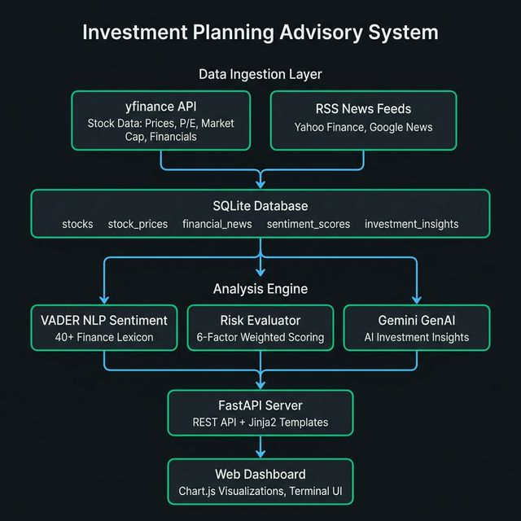

# Investment Planning Advisory System

A stock analysis tool that fetches real-time market data, scores news sentiment with NLP, evaluates risk across six weighted factors, and produces buy/sell/hold recommendations.

**[Live Demo](https://investment-planning-advisory-system.onrender.com/)**

Built with Python, FastAPI, SQLite, VADER sentiment analysis, and Google Gemini (optional).

---

## Features

- **Real-time stock data** — live prices, P/E, market cap, financials via yfinance
- **News sentiment scoring** — VADER with 40+ finance-specific lexicon terms on Yahoo Finance and Google News headlines
- **6-factor risk evaluation** — weighted scoring across valuation, volatility, leverage, sentiment, margins, and beta
- **Investment recommendations** — Gemini-powered (or rule-based fallback) BUY/SELL/HOLD with confidence levels
- **Stock comparison** — compare multiple tickers side-by-side on price, sentiment, risk, and recommendation
- **CSV export** — download analysis results for any stock
- **SQLite storage** — 5 normalized tables for stocks, prices, news, sentiment, and insights
- **Mobile-responsive** — slide-out sidebar navigation on smaller screens

---

## Architecture



---

## Tech Stack

| Layer | Technology |
|---|---|
| Language | Python 3.10+ |
| Web Framework | FastAPI + Uvicorn |
| Database | SQLite |
| Stock Data | yfinance |
| News | RSS feeds via feedparser |
| NLP | NLTK VADER + custom financial lexicon |
| GenAI (optional) | Google Gemini |
| Frontend | HTML5, CSS3, JavaScript, Chart.js, Font Awesome |
| Templating | Jinja2 |

---

## Quick Start

```bash
# Clone
git clone https://github.com/SinkAnkit/investment-planning-advisory-system.git
cd investment-planning-advisory-system

# Set up environment
python3 -m venv venv
source venv/bin/activate  # Linux/Mac
# venv\Scripts\activate   # Windows

# Install dependencies
pip install -r requirements.txt

# (Optional) Add Gemini API key for AI-powered insights
echo "GEMINI_API_KEY=your_key_here" > .env

# Run
python -m uvicorn main:app --host 0.0.0.0 --port 8000 --reload
```

Then open **http://localhost:8000**.

The system works without a Gemini key — it falls back to a rule-based recommendation engine.

---

## API Endpoints

| Method | Endpoint | Description |
|---|---|---|
| GET | `/` | Web dashboard |
| GET | `/api/analyze/{ticker}` | Run full pipeline for a stock |
| GET | `/api/batch?tickers=AAPL,GOOGL` | Batch analyze (max 10) |
| GET | `/api/stocks` | List all analyzed stocks |
| GET | `/api/stock/{ticker}` | Get cached stock data |
| GET | `/api/news/{ticker}` | News + sentiment for a stock |
| GET | `/api/insights/{ticker}` | Latest investment insight |
| GET | `/api/prices/{ticker}?period=1mo` | Price history (1mo, 3mo, 1y) |
| DELETE | `/api/stock/{ticker}` | Remove from history |
| GET | `/api/health` | Health check |

---

## How It Works

1. **Data collection** — yfinance for real-time prices and financials; feedparser for RSS news from Yahoo Finance and Google News.

2. **Sentiment analysis** — NLTK VADER enhanced with finance-specific terms (bullish, bearish, rally, crash, etc.). Each headline gets a compound score; aggregate per stock.

3. **Risk evaluation** — 6-factor weighted model:
   - P/E Ratio (20%) — valuation
   - Price Volatility (20%) — 52-week range
   - Debt-to-Equity (20%) — leverage
   - Sentiment (20%) — market mood
   - Profit Margins (15%) — operational health
   - Beta (5%) — market sensitivity

4. **Recommendation** — All metrics fed to Gemini for a structured recommendation (or rule-based fallback if no API key). Output includes confidence level, key reasons, and risk warnings.

---

## Project Structure

```
├── main.py                  # FastAPI app (9 endpoints)
├── config.py                # Configuration
├── requirements.txt         # Dependencies
├── data/
│   ├── __init__.py          # SQLite schema + CRUD
│   ├── stock_fetcher.py     # yfinance data fetcher
│   └── news_fetcher.py      # RSS news fetcher
├── analysis/
│   ├── __init__.py          # VADER sentiment analyzer
│   ├── risk_evaluator.py    # Risk scoring engine
│   └── insight_generator.py # Gemini / rule-based insights
├── pipeline/
│   └── __init__.py          # Pipeline orchestrator
├── static/
│   ├── css/style.css
│   └── js/app.js
└── templates/
    └── index.html
```

---

## Disclaimer

This is an educational project. It is not financial advice. Always do your own research before making investment decisions.

---

## License

MIT
